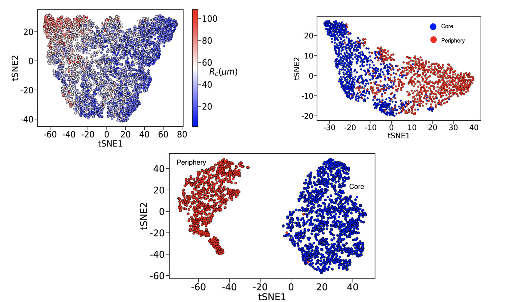

# High-dimensional-unsupervised-dynamical-clustering
Self-generated persistent random forces drive phase separation in growing tumors




## 📌 Overview
This repository contains the **Jupyter Notebook** file used in our paper:

> **"Self-generated persistent random forces drive phase separation in growing tumors"**  
> **Authors:** Sumit Sinha, and D. Thirumalai  
> **Published in:** *J. Chem. Phys. 153, 201101 (2020)*
> **DOI:** [https://doi.org/10.1063/5.0026590](https://doi.org/10.1063/5.0026590)  

This repository contains the MATLAB/C++ code, data analysis scripts used to develop and validate a statistical mechanical model for intra-tumor heterogeneity (ITH). The model predicts spatial and temporal genetic variations within a single tumor and is validated against multi-region sequencing (M-Seq) data for skin, lung, and kidney cancers..

---

## 📂 Repository Structure
```text
/Glass-to-Fluid-Solid-tumors
│── code/         # MATLAB & Python scripts for simulations
│   ├── jupyter_notebook/   # MATLAB-specific scripts
│── requirements.txt
│── README.md     # Project documentation
│── LICENSE       # Licensing information
```


---

## 🚀 Getting Started
### 1️⃣ Clone the Repository
To download the code, use:
```sh
git clone https://github.com/sumit-sinha-seas/High-dimensional-unsupervised-dynamical-clustering.git
cd High-dimensional-unsupervised-dynamical-clustering
```

### 2️⃣ Running the Jupyter Notebook
#### **Install the requirements.txt** and run in Colab


## 🧬 Key Insights:

-Tumor cells in the core exhibit glassy, sub-diffusive behavior, while those in the periphery move in a super-diffusive manner. Traditional measures like mean squared displacement fail to capture this heterogeneity. Unsupervised Machine Learning Reveals Phase Separation:

-The study uses t-distributed stochastic neighbor embedding (t-SNE), a machine learning technique, to visualize the dynamical phase space of tumor cells.
Cells in the tumor partition into two distinct clusters (core vs. periphery), highlighting a non-equilibrium phase separation.
Cell Division-Induced Active Forces Drive Separation:

- The phase separation is caused by self-generated active forces (SGAFs) due to an imbalance in cell division and apoptosis.
Cells in the periphery experience highly persistent outward forces, leading to greater mobility.
Strong Correlation Between Force Persistence and Tumor Expansion:

- Force persistence (FF) is significantly higher in the periphery, explaining why cells at the tumor boundary move radially outward.
This imbalance in force generation between the core and periphery is a key driver of tumor invasion.
Comparison with Experimental Data:

- The study’s findings align with live imaging experiments that show distinct dynamic behaviors between tumor core and periphery.
The results suggest that heterogeneity in tumor dynamics is driven by microenvironment fluctuations, not genetic mutations.
Shape Parameter as a Marker for Phase Transition:


## 📜 Citation
If you use this code in your research, please cite our paper:
```bibtex
@article{sinha2020self,
  title={Self-generated persistent random forces drive phase separation in growing tumors},
  author={Sinha, Sumit and Thirumalai, D},
  journal={The Journal of Chemical Physics},
  volume={153},
  number={20},
  year={2020},
  publisher={AIP Publishing}
}
```

